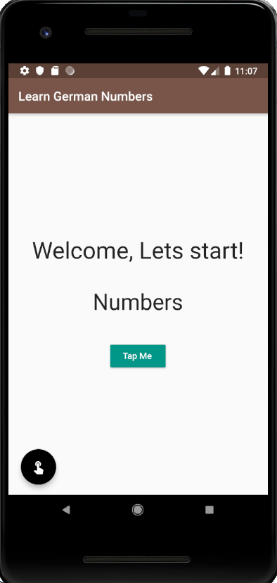

# GermanNumbers
A basic Flutter project which generates English numbers from 1 to 10 and translates them to German simultaneously
### 👉 If you like this repo then please give it a ⭐️

## Short Description
This Flutter app converts the English number from 1 to 10. After reaching 10 it again comes back to one. It has two buttons, both of which does the same job and any one or both could you used. 📳

## Screenshots
  {width:280px;}
     
